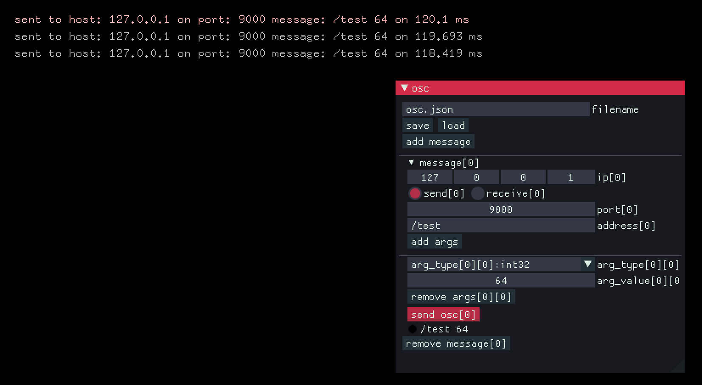

# OscTest

Osc sender/receiver generator app.

## usage

- Press "add message" button to create new OSC message.

- Choose send or receive radio button.

- Enter address. e.g. `/test`

- Press "add args" to add a new argument.

- Select arg_type. e.g. `int32`

- Enter/ slide arg_value.

- Press "send osc" button to send message.

- If you chose receive, then check "receive osc" to start receiving osc.

- enter filename and press "save" to save current settings.

## addons

- ofxGlobalContext
- ofxImGui
- ofxPubSubOsc
